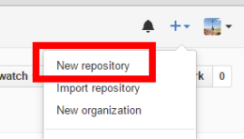
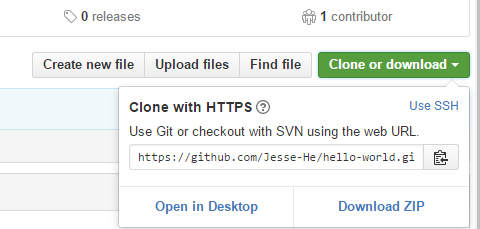
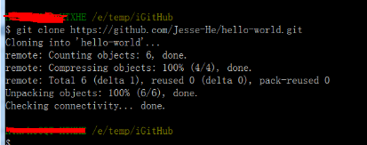
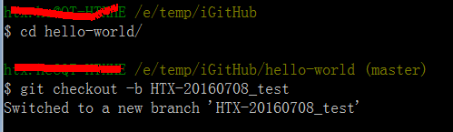

# hello-world
Create a new repository step by step

## 1 新建项目
 * 点击右上角的“+”，新建项目
 * 
 * 在页面中你就可以看到新建的项目 

## 2 clone 项目

 * 点击右上角的“+”，新建项目
 * 
 * 
 * 通过git clone 命令clone 项目到本地 ，然后再本地目录中就可以看到里面的文件了。

## 3 新建分支、修改、上传
 * 为了更好的开发，可以新建分支
 * 新建分支可以在github网页上点击新建，也可以用命令新建。
 *  
 *  这样就新建好了一个新的分支
 > 
 > 接下来你就可以编写你需要实现的代码了。

## 3 新建分支、修改、上传